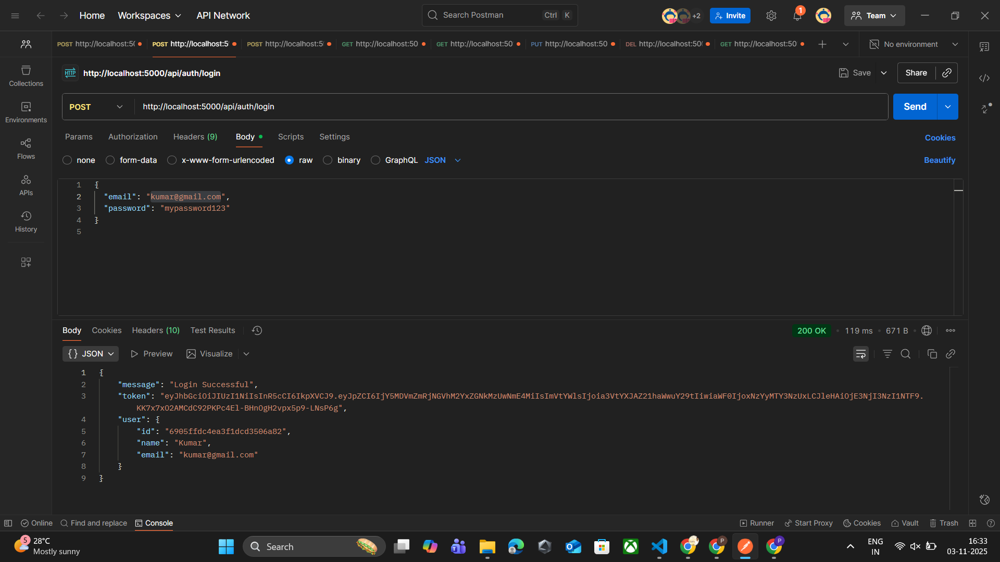
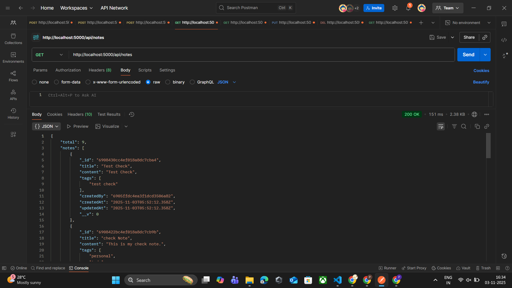
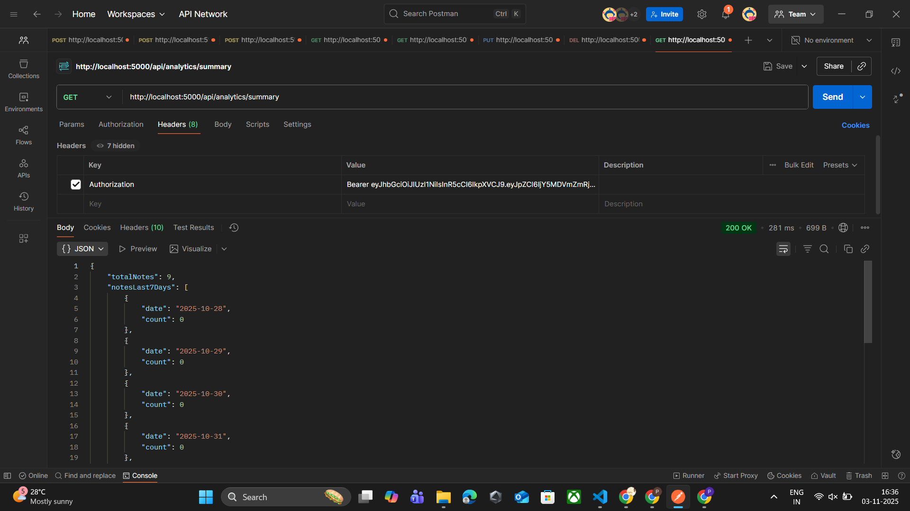

# 📝 TeamNotes — MERN Fullstack Application

**Author:** Pranay Manepally  
**Stack:** MongoDB • Express.js • React.js • Node.js  
**Deployment:** Render (Backend) • Vercel (Frontend) • MongoDB Atlas (Database)  
**Charts:** Recharts

---

## 🚀 Overview

**TeamNotes** is a full-stack productivity tool that allows users to **create, edit, delete, and analyze** personal notes.  
It includes **JWT-based authentication**, a clean responsive UI, and simple analytics for tracking note activity.

This project was built as part of the **MERN Fullstack Assignment**, demonstrating end-to-end integration between a modern frontend and secure backend API.

---

## 🧩 Features

✅ Secure Authentication (JWT + bcrypt)  
✅ Notes CRUD (Create, Read, Update, Delete)  
✅ Tag support and date tracking  
✅ Analytics Dashboard (Total notes, Top tags, Notes per day)  
✅ Global search with debounce  
✅ Responsive UI using Tailwind CSS  
✅ Toast notifications & loading states  
✅ Global error handling  
✅ Modern gradient theme

---

## 🛠️ Tech Stack

| Layer            | Technology                                       |
| ---------------- | ------------------------------------------------ |
| Frontend         | React (Vite) + Tailwind CSS + Lucide React Icons |
| Backend          | Node.js + Express.js                             |
| Database         | MongoDB Atlas                                    |
| Authentication   | JWT + bcrypt                                     |
| Charts           | Recharts                                         |
| State Management | React Context API                                |
| Deployment       | Vercel (frontend), Render (backend)              |

---

## 📦 Project Structure

```bash
TeamNotes/
├── backend/
│   ├── controllers/
│   ├── middleware/
│   ├── models/
│   ├── routes/
│   ├── validators/
│   ├── config/
│   ├── index.js
│   ├── package.json
│   └── .env.sample
│
├── frontend/
│   ├── src/
│   │   ├── api/
│   │   ├── components/
│   │   ├── context/
│   │   ├── pages/
│   │   └── main.jsx
│   ├── public/
│   ├── .env.sample
│   ├── tailwind.config.js
│   ├── package.json
│   └── README.md
│
├── docs/
│   ├── screenshots/
│   │   ├── login.png
│   │   ├── notes.png
│   │   ├── edit_modal.png
│   │   └── analytics.png
│   ├── sampleResponses.json
│   └── API_Documentation.md
│
├── .gitignore
└── README.md
```

---

## ⚙️ Setup Instructions

### 1️⃣ Clone the repository

```bash
git clone https://github.com/<your-username>/TeamNotes.git
cd TeamNotes
```

### 2️⃣ Backend Setup

```bash
cd backend
cp .env.sample .env     # Fill values
npm install
npm run dev             # Starts on http://localhost:5000
```

### 3️⃣ Frontend Setup

```bash
cd ../frontend
cp .env.sample .env     # VITE_API_URL=http://localhost:5000/api
npm install
npm run dev             # Starts on http://localhost:5173
```

---

## 🧾 Environment Variables

### 📍 backend/.env.sample

```env
PORT=5000
MONGODB_URI=your_mongodb_connection_string
JWT_SECRET=your_secret_key
JWT_EXPIRES_IN=7d
BCRYPT_SALT_ROUNDS=10
CORS_ORIGIN=http://localhost:5173
```

### 📍 frontend/.env.sample

```env
VITE_API_URL=http://localhost:5000/api
```

---

## 📡 API Documentation

### 🔐 Authentication

| Endpoint           | Method | Description                    |
| ------------------ | ------ | ------------------------------ |
| `/api/auth/signup` | POST   | Register new user              |
| `/api/auth/login`  | POST   | Authenticate user & return JWT |

### 🗒️ Notes

| Endpoint         | Method | Description                         |
| ---------------- | ------ | ----------------------------------- |
| `/api/notes`     | GET    | Fetch all notes (supports ?search=) |
| `/api/notes`     | POST   | Create a new note                   |
| `/api/notes/:id` | PUT    | Update existing note                |
| `/api/notes/:id` | DELETE | Delete a note                       |

### 📊 Analytics

| Endpoint                 | Method | Description                                  |
| ------------------------ | ------ | -------------------------------------------- |
| `/api/analytics/summary` | GET    | Returns total notes, notes per day, top tags |

> All routes except signup/login require:  
> `Authorization: Bearer <token>`

---

## 💡 Design Decisions

- **Schemas**
  - `User`: `{ name, email, password }`
  - `Note`: `{ title, content, tags: [String], createdBy, createdAt }`
- **Security**
  - bcrypt password hashing, JWT token validation, protected routes
- **Search**
  - Case-insensitive regex search on title/content/tags
- **Architecture**
  - Modular MVC (controllers, routes, middleware)
- **Styling**
  - Tailwind CSS for responsive UI
- **AI Tools**
  - Used only for planning and documentation (logic verified manually)

---

## 🧱 Architecture Overview

Frontend → Axios (`apiClient`) → Express Routes → Controller → Mongoose → MongoDB → Response → React UI update.

- **Frontend:** React + Context for authentication
- **Backend:** Express + Mongoose + JWT + bcrypt
- **Analytics:** MongoDB aggregation pipelines
- **Charts:** Recharts
- **State:** LocalStorage + Context

---

## 📊 Analytics Overview

- **Total Notes:** Count of user’s created notes.
- **Notes per day:** Aggregated for last 7 days.
- **Top Tags:** Top 3 tags used most frequently.

---

## 🔍 Search (with debounce)

Implemented both in backend and frontend:

- **Backend:** Supports query `GET /api/notes?search=term`  
  → Uses regex filter for title/content/tags.
- **Frontend:** Debounced input (300ms delay before fetching).

---

## 💅 UI / Styling

- Tailwind gradient theme (indigo-blue shades)
- Responsive layouts (mobile, tablet, desktop)
- Accessible buttons, hover states
- Animated loader and toast notifications
- Clean modals with overlay and close buttons

---

## 📸 Screenshots

| View      | Example                                      |
| --------- | -------------------------------------------- |
| Login     |          |
| Notes     |          |
| Analytics |  |

---

## 🚀 Deployment

### 🌐 Backend — Render

1. Push repo to GitHub.
2. Go to [Render.com](https://render.com).
3. Create a **Web Service** → Select repo → Set root to `/backend`.
4. Add environment variables (from `.env`).
5. Build command: `npm install`
6. Start command: `npm start`
7. Copy deployed URL (e.g., `https://teamnotes-api.onrender.com`).

### 💻 Frontend — Vercel

1. Go to [Vercel.com](https://vercel.com).
2. Connect same GitHub repo.
3. Set root directory to `/frontend`.
4. Build command: `npm run build`
5. Output directory: `dist`
6. Add env var:
   ```env
   VITE_API_URL=https://teamnotes-api.onrender.com/api
   ```
7. Deploy.

### ☁️ Database — MongoDB Atlas

1. Create free cluster at [MongoDB Atlas](https://www.mongodb.com/cloud/atlas).
2. Add DB user and IP whitelist (`0.0.0.0/0` for dev).
3. Get connection string → paste in backend `.env`.

---

## 🧹 Code Cleaning & Commit Guidelines

Before pushing:

- Remove all `console.log` and temporary comments.
- Ensure `.env` files are **not** pushed.
- Run:
  ```bash
  npm run lint
  npm run format
  npm audit fix
  ```
- Add `.env.sample` files in both backend and frontend.
- Add screenshots under `docs/screenshots`.

---

## 📘 Evaluation Mapping

| Criteria                    | Description                                   | Points |
| --------------------------- | --------------------------------------------- | ------ |
| Architecture & Code Quality | Modular folder structure, reusable components | 20     |
| Backend Logic               | JWT + bcrypt + CRUD + Aggregations            | 15     |
| Frontend Functionality      | CRUD, validation, loaders, toasts             | 20     |
| Authentication & Security   | Secure login/signup flow                      | 10     |
| Analytics Dashboard         | Charts + Aggregation                          | 15     |
| UX & Polish                 | Responsive, consistent UI                     | 10     |
| Documentation               | README + .env.sample + Screenshots            | 10     |
| Bonus                       | Search + Deployment + Dark Theme              | +5     |

---

## 🧠 Future Improvements

- Add pagination & sorting
- Share notes between users
- Add dark/light mode
- Refresh tokens for extended sessions
- Integrate file attachments

---

## 🪪 License

This project is licensed under the **MIT License**.

---

## 👨‍💻 Author

**Pranay Manepally**  
Full-Stack Developer (MERN)  
📧 Email: [manepallypranay98@gmail.com](mailto:manepallypranay98@gmail.com)  
🔗 LinkedIn: [https://www.linkedin.com/in/pranay-manepally/](https://www.linkedin.com/in/pranay-manepally/)
